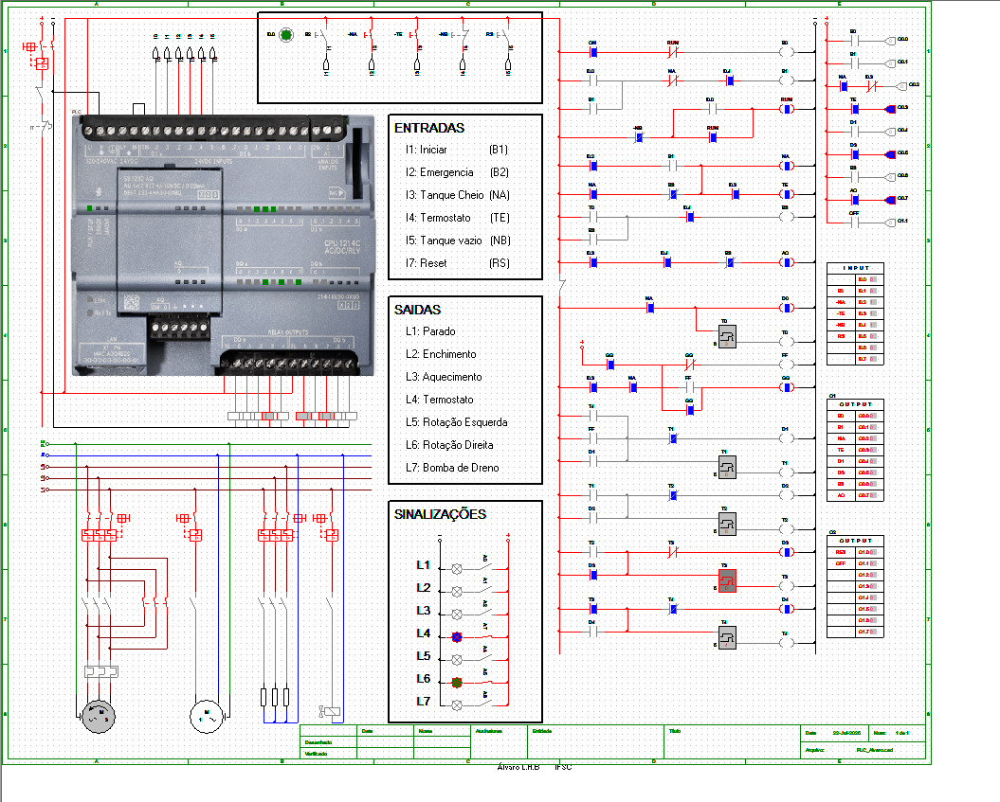
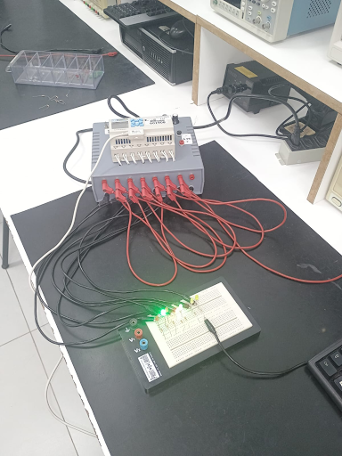

# Processo de acionamento e automacao via CLP

Deenvolvimento e programação de processo de acionamento e automação de tanque para tratamento térmico com agitador 
bidirecional, bomba de saída e eletroválvula de entrada. Projeto deenvolvido utilizando simulador CLP `CADe SIMU` 
durante diciplina `Maquinas e acionametos` e aplicado em prática em bancada na disciplina de `Automação Industrial` utilizando o CLP `WEG Clic-02/20VR-D`.

 

<b>Progamação Ladder e simulação dos motores</b>

foram utilizados lEDs como saida analogica para simular a ativação dos componentes, como mostra na seção de `sinalizações` na imagem acima.

 

<b>Prática em bancada com CLP</b>

